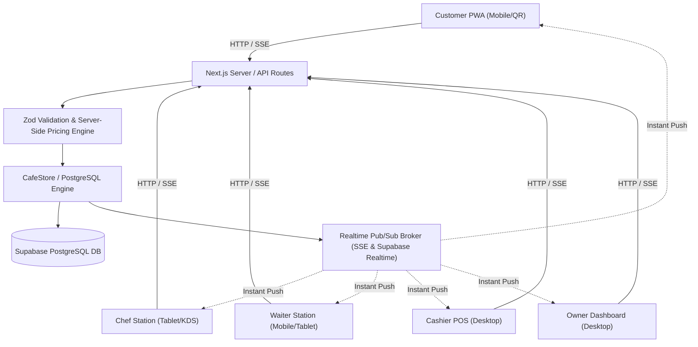

# Architecture Overview — Velvet Bloom Café

The Velvet Bloom Café digital ordering platform follows a modular, reactive, clean architecture built on **Next.js 15 App Router** and **Supabase PostgreSQL**.

## Key Architectural Principles

1. **One Source of Truth (Server Authority):**
   - Client applications never calculate final prices, taxes, or discounts.
   - Prices and option costs are fetched dynamically from database records inside transactional operations.

2. **Controlled State Transitions:**
   - Order progression follows a strict state machine: `PENDING` ➔ `ACCEPTED` ➔ `PREPARING` ➔ `READY` ➔ `SERVED` ➔ `COMPLETED`.
   - Rejections or cancellations generate immutable audit events (`order_events`).

3. **Multi-Station Realtime Pub/Sub:**
   - Actions taken on one station immediately propagate to all connected clients via Server-Sent Events (SSE) and Supabase Realtime without manual polling or page reloading.

4. **Offline Resilient PWA:**
   - Service worker caches core UI assets and fonts while guaranteeing that dynamic pricing and availability checks always remain fresh and authoritative.
