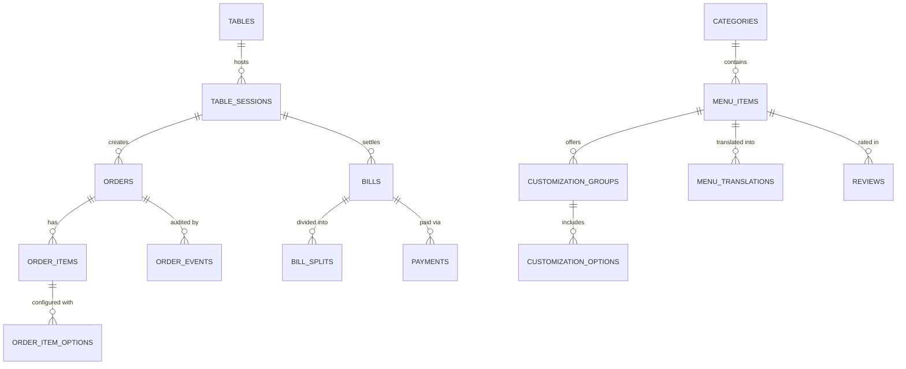

# Database Schema & Data Models — Velvet Bloom Café

The application uses PostgreSQL with primary keys, foreign keys, unique constraints, and check constraints.

## Core Relational Schema

## Entity Details

- **`cafe_settings`**: Global cafe configuration (tax rates, service charge, kitchen ordering pause toggle, busy notices).
- **`users`**: Staff and administrator profiles with PIN codes and assigned roles.
- **`tables`**: Physical table records, guest capacity, and unique QR code tokens.
- **`table_sessions`**: Temporal sessions isolating customer orders per visit.
- **`categories`**: Menu categories with custom display ordering and icons.
- **`menu_items`**: Culinary and beverage items with nutritional metrics, prep times, veg/non-veg flags, and average ratings.
- **`menu_translations`**: Localized item names and descriptions (Telugu, Hindi).
- **`customization_groups` & `customization_options`**: Multi-level item customizations (milk choices, sweetness levels, spice ratings, gourmet add-ons).
- **`orders` & `order_items`**: Placed customer/manual tickets with server-recalculated pricing and line-item totals.
- **`order_events`**: Immutable audit logs capturing status transitions, timestamps, and actor identifiers.
- **`bills` & `bill_splits`**: Invoicing engine supporting full payments, equal splits, and item-wise divisions.
- **`payments`**: Payment transaction records (UPI, Card, Cash).
- **`reviews`**: Verified customer ratings (1-5 stars) and feedback.
- **`notifications` & `service_requests`**: Real-time staff assistance alerts and floor requests.
